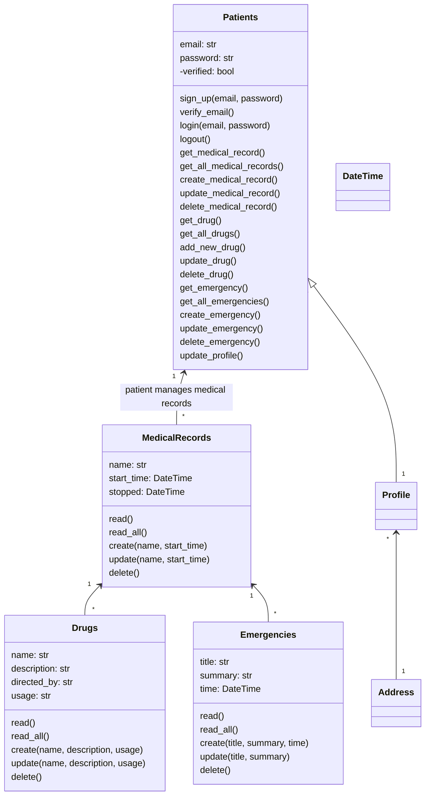

```mermaid
classDiagram
    class Patients {
        email: str
        password: str
        -verified: bool
        sign_up(email, password)
        verify_email()
        login(email, password)
        logout()
        get_medical_record()
        get_all_medical_records()
        create_medical_record()
        update_medical_record()
        delete_medical_record()
        get_drug()
        get_all_drugs()
        add_new_drug()
        update_drug()
        delete_drug()
        get_emergency()
        get_all_emergencies()
        create_emergency()
        update_emergency()
        delete_emergency()
        update_profile()
    }
    Patients "1" <-- "*" MedicalRecords : patient manages medical records
    class MedicalRecords {
        name: str
        start_time: DateTime
        stopped: DateTime
        read()
        read_all()
        create(name, start_time)
        update(name, start_time)
        delete()
    }
    class Drugs {
        name: str
        description: str
        directed_by: str
        usage: str
        read()
        read_all()
        create(name, description, usage)
        update(name, description, usage)
        delete()
    }
    MedicalRecords "1" <-- "*" Drugs
    Patients "1" <|-- "1" Profile
    MedicalRecords "1" <-- "*" Emergencies
    class Emergencies {
        title: str
        summary: str
        time: DateTime
        read()
        read_all()
        create(title, summary, time)
        update(title, summary)
        delete()
    }
    class DateTime
    class Profile
    class Address
    Profile "*" <-- "1" Address
```
